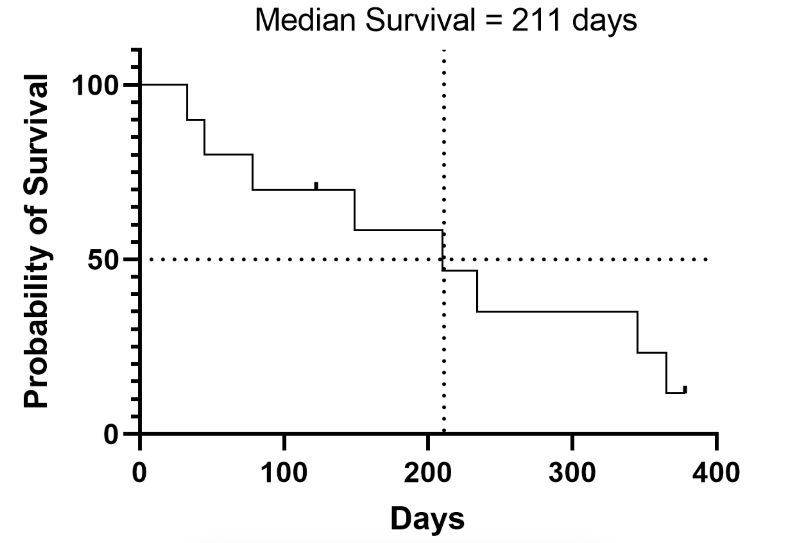
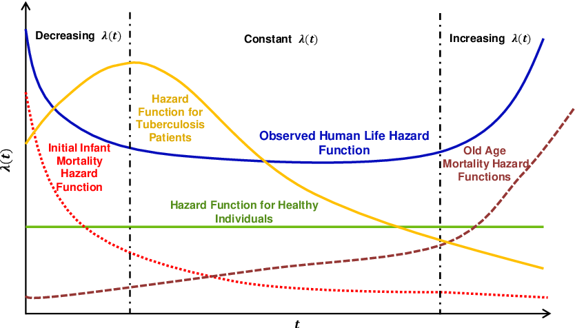

# Introduction

**Survival analysis** is a branch of statistics for analyzing the expected duration of time until one event occurs. Even though the original name suggests this field is mainly connected to life sciences, this is not the case.

Let's take a look at some real-world application domains where survival analysis can be utilized:

-   predicting device failure

-   modelling marriage length,

-   churn prediction,

-   predicting kidney failure,

-   analyzing student dropout rates,

-   etc.

Depending on the type of application therefore the field is also known as *lifetime data analysis*, *reliability analysis*, *time to event analysis*, and *event history analysis*.

To determine failure time precisely, there are three requirements:

1.  a time origin must be unambiguously defined,
2.  a scale for measuring the passage of time must be agreed,
3.  the meaning of failure must be entirely clear.

## Fundamental concepts

$T$ ... non-negative continuous random variable representing the time until the event occurs

$f(t)$ ... probability density function

$F(t) = P(T < t)$ ... cumulative distribution function

$S(t) = P(T \geq t) = 1 - F(t)$ ... survival function

$h(t) =\frac{f(t)}{S(t)}$... hazard rate

$H(t)$ ... cumulative hazard


*Image source: <https://arxiv.org/abs/1708.04649>*

## Censored data

What distinguishes survival analysis from other areas in statistics is the data that are usually censored.

Censored data is **any data for which we do not know the exact event time**.

We distinguish between Type I and Type II censoring:

-   In Type I censoring we observe all individuals for a specific time period or until failure.

-   Type II censoring design can often be found in engineering, where a total of *n* objects are observed and the study ends when *r* of them fail.

Observations can be *point-censored* or *interval-censored*. Let's take a look at point censoring:


Interval censoring is shown in the bottom figure:


## How to handle censored data?

-   **Complete data analysis**: ignore the censored observations.

-   **Imputation**: make (false?) assumptions about censored observations.

-   **Dichotomized data analysis**: binarize the problem, e.g. only focus on whether the event occurred or not.

-   **Likelihood-based approach**: adjust the likelihood based on whether the individual was censored or not. Mind the censoring assumptions!

### Likelihood construction

In a study with $n$ individuals let $t_i$ denote the observation time for the $i$-th individual and let $\delta_i$ be their event indicator ($\delta_i = 1$ if the event occurred, $\delta_i = 0$ if the individual was censored). Let $T_i$ be a random variable representing the time until the event occurs and let $C_i$ be a random variable representing the time of censoring. While either $T_i$ or $C_i$ may never be observed, together with the information about censoring we can construct a random variable that is associated with $t_i$: $\tau_i = \min{(T_i, C_i)}$. We can now take a look at the probability distribution of the pair $(\tau_i, \delta_i)$ for censored and uncensored observations.

Let us first consider the case when $\delta_i = 0$:

$$
\begin{align*}
P(\tau_i = t, \delta_i = 0) = P(C_i = t, T_i > t) \overset{\substack{\text{indep.} \\ \text{cens.}}}{=} P(C_i = t)P(T_i > t).
\end{align*}
$$

For the sake of simplicity, we can understand $P(C_i = t)$ to be the probability density function of $C_i$ and thus get $P(\tau_i = t, \delta_i = 0) = f_{C_i}(t)S_{T_i}(t)$, where $S_{T_i}(t)$ is the survival function of $T_i$. Let us now consider the case when $\delta_i = 1$:

$$
\begin{align*}
P(\tau_i = t, \delta_i = 1) = P(T_i = t, C_i > t) \overset{\substack{\text{indep.} \\ \text{cens.}}}{=} P(T_i = t)P(C_i > t).
\end{align*}
$$

Again, let us say simplify and say that $P(T_i = t)$ equals to $f_{T_i}(t)$, which gives us $P(\tau_i = t, \delta_i = 1) = f_{T_i}(t)S_{C_i}(t)$, where $S_{C_i}(t)$ is the survival function of $C_i$.

Joining the two results and taking into account all $n$ individuals gives us the following expression:

$$
\begin{align*}
\prod_{i=1}^{n}\left[f_{T_i}(t_i)S_{C_i}(t_i)\right]^{\delta_i} \left[f_{C_i}(t_i)S_{T_i}(t_i)\right]^{(1-\delta_i)},
\end{align*} 
$$ which we can rewrite as

$$
\begin{align*}
\prod_{i=1}^{n}f_{T_i}(t_i)^{\delta_i}S_{T_i}(t_i)^{(1-\delta_i)}
\prod_{i=1}^{n}f_{C_i}(t_i)^{(1-\delta_i)}S_{C_i}(t_i)^{\delta_i}.
\end{align*}
$$

Since we are interested in the distribution of survival times the second product term can be seen as a constant on account of the assumption of non-informative censoring, which states that the distribution of $C_i$ does not involve any parameters relevant to the distribution of $T_i$ (and vice versa). Finally, the likelihood can therefore be defined as:

$$
\begin{align*}
\mathcal{L} = \prod_{i=1}^{n}f_{T_i}(t_i)^{\delta_i}S_{T_i}(t_i)^{(1-\delta_i)},
\end{align*}
$$ or, considering the hazard rate definition and simplifying the indexing, its alternative formulation is

$$
\begin{align}
\mathcal{L} = \prod_{i=1}^{n}h(t_i)^{\delta_i}S(t_i).
\end{align}
$$

Now let's get to know our data.

## Veterans' Administration Lung Cancer study

The dataset we’ll be working with today is one that was published in *The Statistical Analysis of Failure Time Data* by Kalbfleisch and Prentice. It is described as follows:

> In this trial, **137** males with advanced inoperable lung cancer were randomized to either a standard or test chemotherapy. The primary endpoint for therapy comparison was time to death. Only 9 of the 137 survival times were censored.

The dataset is made available in the R *survival* package.

```{r}
library(survival)
```

Columns:

-   `trt`: treatment, 1=standard, 2=test
-   `celltype`: histological type of tumor
-   `time`: survival time (in days)
-   `status`: censoring status, 1=death, 0=censored
-   `karno`: Karnofsky performance score (100 means good)
-   `diagtime`: months from diagnosis to treatment
-   `age`: age in years
-   `prior`: prior therapy, 0=no, 10=yes

```{r}
dat <- veteran
summary(veteran)
```

```{r treatment}
# preprocess: standard=0, test=1
dat$trt <- dat$trt - 1
treatment <- factor(dat$trt, levels=c(0,1), labels=c("standard", "test"))
table(treatment)
```

```{r age}
library(ggplot2)
ggplot(dat, aes(x=age)) + 
    geom_bar() + 
    xlab("age in years") +
    theme_bw()
```

```{r diagtime}
ggplot(dat, aes(diagtime)) +
    geom_bar() + 
    xlab("months from diagnosis to treatment") +
    theme_bw()
```

```{r celltype}
ggplot(dat, aes(x=celltype)) + 
    geom_bar() + 
    xlab("cell type") + 
    theme_bw()
```

```{r prior}
# preprocess, prior therapy 1=yes, 0=no
dat$prior <- dat$prior / 10
prior <- factor(dat$prior, levels=c(0,1), labels=c("no", "yes"))
table(prior)
```

```{r karno}
ggplot(dat, aes(x=karno)) + 
    geom_bar() + 
    xlab("Karnofsky performance score") + 
    scale_x_continuous(breaks = seq(0, 100, by=5)) +
    theme_bw()
```

```{r time}
ggplot(dat, aes(x=time)) + 
    geom_histogram(binwidth=20) + 
    xlab("time [days]") + 
    theme_bw()
```

```{r status}
status <- factor(dat$status, levels=c(0, 1), labels = c("censored", "death"))
table(status)
```

```{r store}
# store preprocessed dataset
write.csv(dat, "../data/veteran_preprocessed.csv")
```

**Q: What type of censored data are we dealing with?**

In this workshop, we focus on the **Type I censoring design**, our data is **right-censored** and we assume **non-informative censoring**, which means that the distribution of survival times provides no information about the distribution of censorship times and vice versa.

There are better ways to explore survival data. Let's see how.

## Survival curves

Survival functions seem to be the most intuitive for humans.

$S(t) = P(T \geq t) = 1 - F(t)$ ... survival function

Description: *The survival function, S(t), is a measure of the probability of survival or non-occurrence of an event up to time, t.*

More intitive: *The survival function indicates the proportion of a population expected to survive beyond a certain time point, t.*



-   **Median survival time**: Median survival time is the time at which 50% of the population has experienced the event of interest.

## Kaplan-Meier curves

Let's first familiarize ourselves with Kaplan-Meier curves on a toy example.

| Name    | Time | Event |
|:--------|-----:|------:|
| Anthony |    2 |     1 |
| Bert    |    3 |     1 |
| Chloe   |    3 |     0 |
| David   |    4 |     1 |
| Elle    |    4 |     1 |
| Fay     |    6 |     0 |
| Gabe    |    7 |     1 |
| Harry   |    8 |     0 |
| Irene   |   10 |     0 |
| Noah    |   10 |     1 |

Kaplan-Meier estimator follows the equation:

$$
  \widehat{S}(t) = \prod_{i: t_i \leq t} \left(1 - \frac{d_i}{n_i}\right),
$$

where $\widehat{S}(0) = 1$.

$d_i$ ... number of events at the time $t_i$

$n_i$ ... number of samples that survived up until $t_i$

### Toy example

Your task is to implement a Kaplan-Meier estimator in R.

```{r echo=T, results='hide'}

time <- c(2, 3, 3, 4, 4, 6, 7, 8, 10, 10)
event <- c(1, 1, 0, 1, 1, 0, 1, 0, 0, 1)

KM_curve <- function(time, event) {
  df <- data.frame(time = time, event = event)
  curve <- data.frame(time = c(0, unique(time)), proba = c(NA))

  S <- 1

  for (i in seq_along(curve$time)) {

    t <- curve$time[i]
    
    d <- sum(df[df$time == t,]$event)
    n <- nrow(df[df$time >= t,])

    S <- S * (1 - d/n)
    curve[i, "proba"] <- S    
  }

  return(curve)
}

curve <- KM_curve(time, event)
```

Use this function to plot the curve:

```{r, fig.width=4, fig.height=3}

plot_survival_curve <- function(curve) {
  ggplot(curve, aes(x = time, y = proba)) +
    geom_step() +
    ylim(0, 1) +
    theme_minimal() +
    labs(x = "Time", y = "Probability", title = "Kaplan-Meier Survival Curve")
}

plot_survival_curve(curve)
```

### Veterans dataset

Now, let's apply our knowledge and functions to our Veterans dataset.

```{r echo=T, results='hide'}

dat <- dat[order(dat$time),]
veterans_curve <- KM_curve(dat$time, dat$status)

plot_survival_curve(veterans_curve)
```

What can we conclude?

## Hazard rate

$h(t) =\frac{f(t)}{S(t)}$... hazard rate

The hazard function is the probability that the person dies in the next instant, given that it survived to time t.

$$
h(t) = \lim_{\Delta t \to 0} \frac{P(t \leq T < t + \Delta t | T \geq t)}{\Delta t}
$$



*Image source: <https://www.semanticscholar.org/paper/Nonparametric-Tests-for-Change-Points-in-Hazard-in-Rois/752fc67d89c018bd16d065bdd794943b182fa64e>*

```{r echo=T, results='hide'}
library('stats')

time <- c(2, 3, 3, 4, 4, 6, 7, 8, 10, 10)
event <- c(1, 1, 0, 1, 1, 0, 1, 0, 0, 1)

moving_average <- function(x, n) {
  filter <- rep(1/n, n)
  stats::filter(x, filter, sides = 1, circular = F)
}

hazard_rate_curve <- function(time, event, filter_size) {
  df <- data.frame(time = time, event = event)
  curve <- data.frame(time = c(0, unique(time)), rate = c(NA))

  h <- 0

  for (i in seq_along(curve$time)) {

    t <- curve$time[i]
    
    d <- sum(df[df$time == t,]$event)
    n <- nrow(df[df$time >= t,])

    curve[i, "rate"] <- d/n
  }

  ma <- moving_average(curve$rate, filter_size)
  padding_size <- filter_size - 1
  padded_ma <- c(curve$rate[1:(padding_size)], ma[filter_size:length(curve$rate)])

  curve$rate <- padded_ma
  return(curve)
}

hazard_curve <- hazard_rate_curve(time, event, 3)
```

```{r, fig.width=4, fig.height=3}

plot_hazard_curve <- function(curve) {
  ggplot(curve, aes(x = time, y = rate)) +
    geom_step() +
    theme_minimal() +
    labs(x = "Time", y = "Hazard Rate", title = "Hazard Rate Curve")
}

plot_hazard_curve(hazard_curve)
```

### Veterans dataset

Now, let's apply our knowledge and functions to our Veterans dataset.

```{r echo=T, results='hide'}

dat <- dat[order(dat$time),]
veterans_hazard_curve <- hazard_rate_curve(dat$time, dat$status, 11)

plot_hazard_curve(veterans_hazard_curve)
```

What can we conclude?
