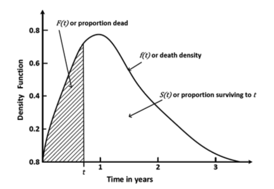

# Introduction

TO DO: Describe different namings, definition, examples

## Fundamental concepts

$T$ ... non-negative continuous random variable representing the time until the event occurs

$f(t)$ ... probability density function

$F(t) = P(T < t)$ ... cumulative distribution function

$S(t) = P(T \geq t) = 1 - F(t)$ ... survival function

\$h(t) =\\frac{f(t)}{S(t)} \$ ... hazard rate

$H(t)$ ... cumulative hazard



## Censored data

TO DO: explain censored data and introduce the dataset

```{r libs}
library(carData)

```

The dataset we’ll be working with today is one that was published in Peter H. Rossi, Richard A. Berk and Kenneth J. Lenihan’s 1980 book, *Money, Work, and Crime: Some Experimental Results* (<https://gwern.net/doc/sociology/1980-rossi-moneyworkandcrime.pdf>). The dataset is made available in the R *carData* package, and is described as follows:

> This data set is originally from Rossi et al. (1980), and is used as an example in Allison (1995). The data pertain to 432 convicts who were released from Maryland state prisons in the 1970s and who were followed up for one year after release. Half the released convicts were assigned at random to an experimental treatment in which they were given financial aid; half did not receive aid.

The [documentation page](https://vincentarelbundock.github.io/Rdatasets/doc/carData/Rossi.html) describes the columns that are present in the dataset.

```{r}
dat <- Rossi
```
